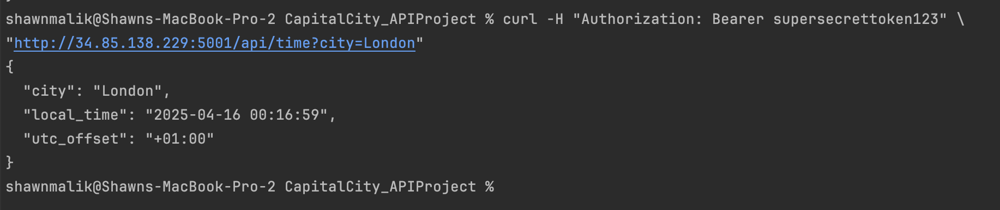

# CapitalCity_APIProject
# DS2002 Assignment
# Name: Shawn Malik

This is a simple API that returns the local time and UTC offset for a given capital city.

IP Address of Working API: http://34.85.138.229:5001/


# Documentation of how to call the API
After SSHing into your GCP VM, you can run the following command to start the API:
```python3 app.py```

From there, you can use the following command to call the API:
curl -H "Authorization: Bearer TOKEN" http://34.85.138.229:5001/api/time?city=CapitalName 

**Note:** Link will show Unauthorized if typing it into your browser as the TOKEN is not correct

**Replace "CapitalName" with the name of the capital city you want to get the time for and TOKEN with your token.**

Example Command:
curl -H "Authorization: Bearer supersecrettoken123" http://34.85.138.229:5001/api/time?city=London

Output:


